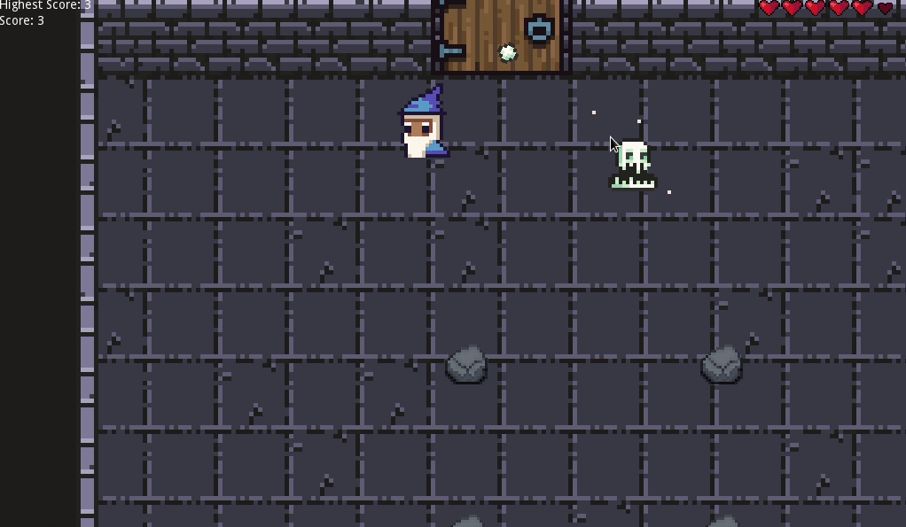

# programowanie-gier

Prosta gierka na zaliczenie przedmiotu "programowanie gier". Część grafik pochodzi z https://0x72.itch.io/16x16-dungeon-tileset. Grupa piątkowa, para z [@ihavegot](https://github.com/Ihavegot)

***
